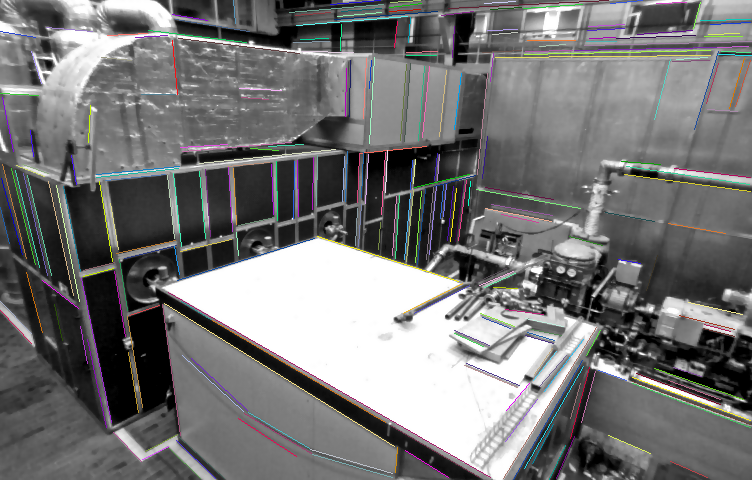

# EDLine-py
Forked from [this](https://github.com/HanjieLuo/EDLine_parallel)



## Update
- added python binding
- added web [api](api/readme.md)

## Requirements ##
The code is tested on Debian GNU/Linux 10. It requires the following tools and libraries: `python3.8`, `pybind11`, `OpenCV 3.4.13`.

## Building ##

```bash
# `pwd` == project_root
pip install pybind11
bash setup.sh
ldconfig
```

Test:

```bash
PYTHONPATH=. python test/demo.py
```
